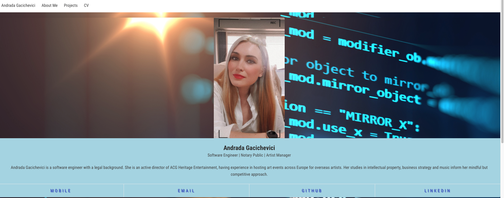
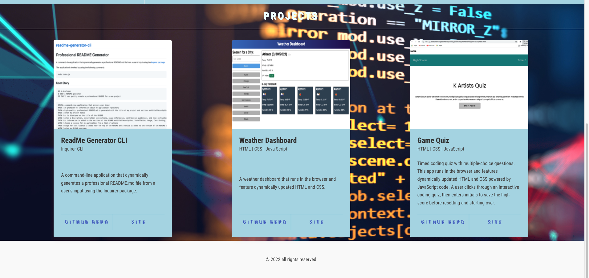
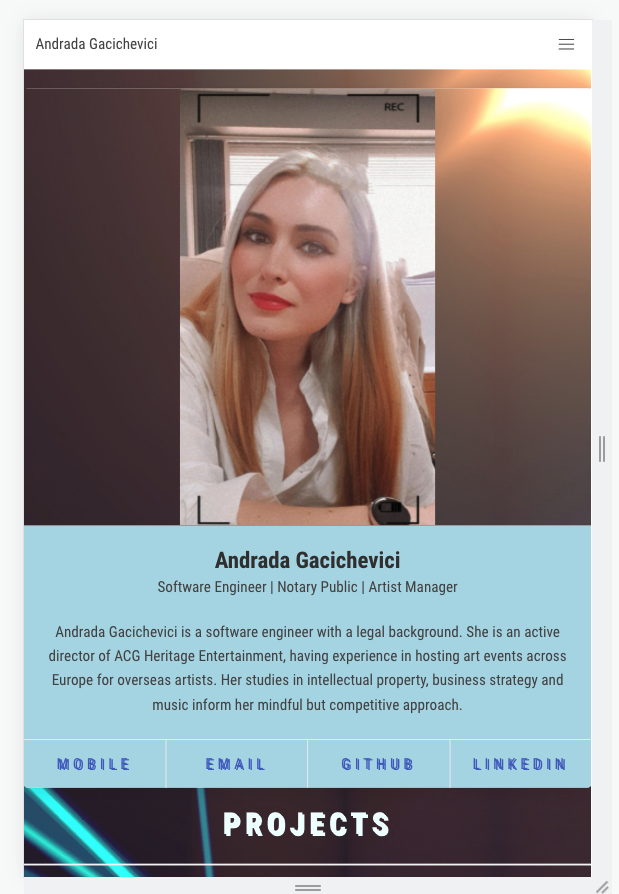

# Portfolio

Portfolio of my projects using HTML and CSS

Displays contact information.

Contains links to GitHub profile and LinkedIn profile.

Contains link to downloadable image of C.V.

Displays 4 projects, each having:

- Project title

- Link to the deployed version

- Link to the GitHub repository

- Screenshot of the deployed application

## Deployed URL

You can view the GitHub pages deployed application [here](https://andradag.github.io/html-css-portfolio/).

## Screenshots

Desktop version

Desktop version

Mobile version

Mobile version

